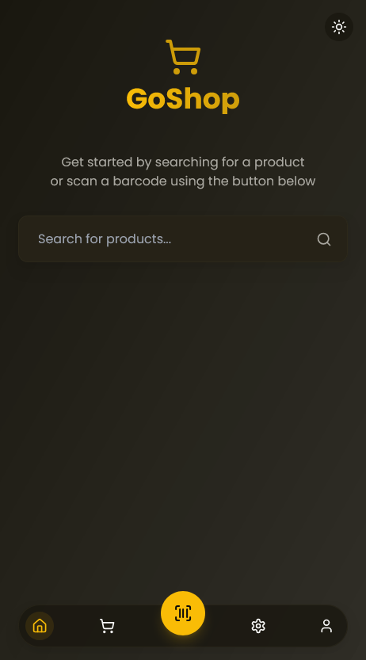
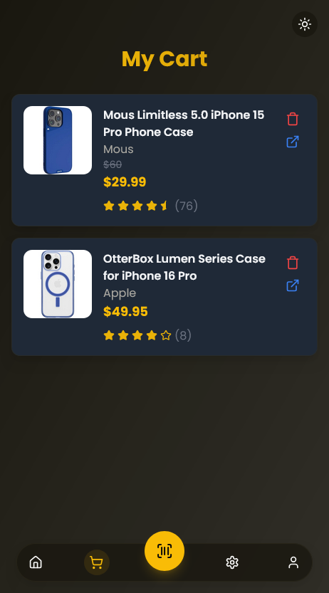
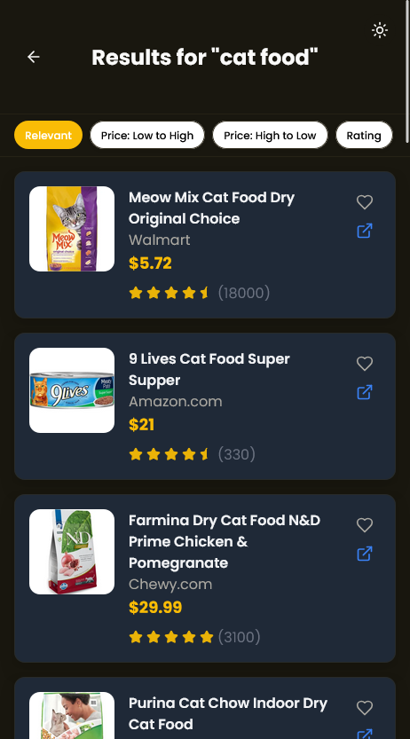
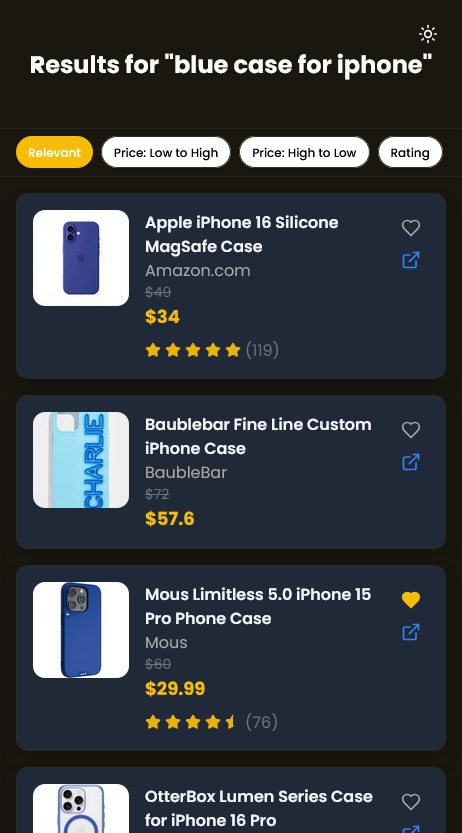

# GoShop

A sleek and modern React + Vite application designed to aggregate prices from multiple e-commerce platforms effortlessly. This project is a complete rewrite of the original [GoCart](https://github.com/suchithh/GoCart), optimized with React for performance and scalability. With built-in barcode scanning, GoShop makes it incredibly easy to look up products in seconds, offering a seamless shopping experience.

🌐 **Live Demo:** [GoShop on Vercel](https://goshop-dusky.vercel.app)

---


## 🚀 Features

- 🔍 **Smart Search**: Use natural language or keywords to find the best deals, powered by SerpAPI and Vercel Serverless Functions.
- 📷 **QR & Barcode Scanning**: Quickly search for products using barcodes or QR codes with the zxing library and Barcode Lookup API.
- 🔐 **Seamless Login**: Google authentication with Clerk for a secure and effortless sign-in experience.
- 🔄 **Cross-Device Sync**: Keep your shopping cart synchronized across all your devices, leveraging Firebase Firestore.
- 🌗 **Dark Mode Toggle**: Switch effortlessly between light and dark themes to suit your preference.

---

## 📸 Screenshots

### Home Page



### Cart



### Barcode Lookup



### Natural Language Search



---

## 🛠 Getting Started

1. **Set Up Environment Variables**  
   Create a `.env.local` file in the root directory with the following configuration:

   ```bash
   # Vite
   VITE_CLERK_PUBLISHABLE_KEY=<your-clerk-publishable-key>

   # Firebase
   VITE_FIREBASE_API_KEY=<your-firebase-api-key>
   VITE_FIREBASE_AUTH_DOMAIN=<your-firebase-auth-domain>
   VITE_FIREBASE_PROJECT_ID=<your-firebase-project-id>
   VITE_FIREBASE_STORAGE_BUCKET=<your-firebase-storage-bucket>
   VITE_FIREBASE_MESSAGING_SENDER_ID=<your-firebase-messaging-sender-id>
   VITE_FIREBASE_APP_ID=<your-firebase-app-id>
   VITE_FIREBASE_MEASUREMENT_ID=<your-firebase-measurement-id>

   # Barcode Lookup
   VITE_BARCODE_LOOKUP_API_KEY=<your-barcode-lookup-api-key>

   # SerpApi
   SERP_API_KEY=<your-serp-api-key>

   ```

2. Install dependencies:

   ```sh
   npm install
   ```

3. Start the development server:

   ```sh
   vercel dev
   ```

4. Open the browser and navigate to `http://localhost:3000/`

## 🗂 Project Structure

- src/pages: Main pages (Home, Cart, SearchResults, etc.).
- src/components: Reusable components (ProductCard, BottomNav, etc.).
- src/hooks: Custom React hooks.
- src/lib: Utility functions and library modules.
- api: Serverless functions for fetching data from SerpAPI.
